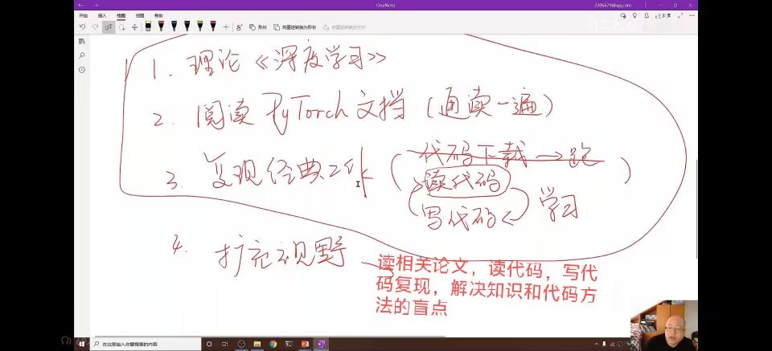
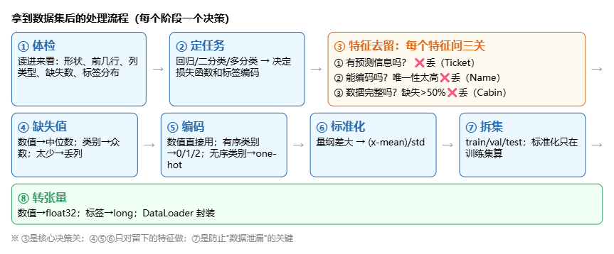

####  对交叉熵（CE）的理解 

1. - \(\sum P_D\ln P_D\)：真实分布的信息熵（一个固定值）
- \(\sum P_D\ln \frac{P_D}{P_T}\)：KL 散度（相对熵），衡量分布差异
- 交叉熵：\(CE = -\sum_i P_D(X=i)\ln P_T(X=i)\)
- 交叉熵 = 信息熵 + KL 散度；描述两个分布之间的差异

2. - 那就是说越真实的事件概率越高，通过 -∑Pd*lnPt 这个函数：
- 如果模型猜到很对，Pd 大的，lnPt 更接近 0，Pd 小的，虽然 lnPt 绝对值大，但与 Pd 相乘后也很小，最后得到的整体（损失）很小
- 如果模型猜的不对，Pd 大的，它的 lnPt 绝对值却也很大，Pd 小的，它对应的 lnPt 也很小，相乘相加后，最后得到的值（损失）也很大。
- 通过真实值 Pd 与预测值 Pt 的对数相乘，我们就能把分布之间的差距用数值（损失）的大小来定量表示

3. - 对于硬标签（one-hot，一个概率为1，其它为0），CE与KL散度在分布完全一致时都是0，但是对于匀称分布，如【0.5，0.2，0.3】这类的，就算完全一样，算出来的最后和（损失）也不是0.  
但是！参数更新看的时损失带来的梯度，而不是损失值本身，两者求梯度时一样的。一般深度学习都用CE

####  对Softmax和Sigmoid(Logistic)两个激活函数

1. sigmoid 的作用就是把输出投映到 0~1 之间，相当于求概率吗，但是对每一个输出单独计算，**各个输出之间互相独立**。 输出向量 \([p_1,p_2]\)，\(p_1+p_2\) **不需要等于 1**。  适合解决二分类，多标签（可同时含有）分类
2. Softmax是把输出 整体计算，**所有输出加起来强制 = 1**。适合多标签单分类
3. 两个现在都少用在隐藏层，都是对最后的输出的处理，但都不是最终的损失，损失函数另找
#### NLLLoss 和 CrossEntropyLoss 的区别
1. 一句话： **CrossEntropyLoss 就是 LogSoftmax + NLLLoss 的合体版**
2. CrossEntropyLoss（交叉熵损失）

\(CE = -\sum_{c=1}^C y_c \log(p_c)\)  
接收**原始 logits**（模型最后一层的输出，没经过任何激活），内部自动做：LogSoftMax把输出归一化，再NLLLOSS进行负对数似然损失

对于一个样本，CE本身接收的数据是一个一维数组，里面的是概率分布，label往往只是一个数字，是一个标签（表示下标值），内部计算时根据标签就可以取出前面数组对应概率求损失

3. NLLLoss（Negative Log Likelihood Loss，负对数似然损失）

\(NLL = -\sum_{c=1}^C y_c \cdot \log p_c\)

NLLLoss 接收的是**已经取过 log 的概率**（log-probabilities），也就是原始输出经过 `log_softmax` 的输出  
它内部**不会**再做 Log_softmax

#### Neural Netwok 的过拟合

中间隐藏层越，模型的学习能力越强，但不是越好。因为会学到一些噪声，模型的泛化能力变弱。即过拟合

## CNN
- 通用步骤
1. 准备数据
2. 构建模型
3. 损失函数和优化器
4. 训练循环：梯度清零，前馈，反馈，更新

- 一个卷积核的通道数一定与输入的通道数一致，然后通道间各自卷，最后相加叠加成一个通道，也就是一个卷积核只输出一个通道

- 把一个（批次,通道数，宽，高）为(b，n,w,h) 的输入图像，输出为(b,m,w2 ,h2),就需要m个通道为n的卷积核
- 卷积核形状（卷积核数目，卷积核通道，宽，长），其中卷积核数目决定输出的通道数，卷积核通道对应输入通道
- 池化会使宽高减半
- 卷积Conv2d也是线性层，需要激活，激活和池化顺序没要求
- 用GPU时，要把模型和参与计算的张量送到gpu,且放到同一个显卡

- 理解dim=? 是按哪个维度压缩   （未完善）
1. 想一想? 那个维度如果新加一个，是沿着哪个方向加的，后面就按这个方向压缩，拼接
2. 例：
二维矩阵(w,h)，宽和高（长和宽）  
dim=1,如果'高'新加，就会在左右方向加，所以拼接或者压缩时，会沿着左右压成一列  
dim=0，就是在‘宽’新加的方向，也就是上下方向相加  
三维（c,w,h）也如此  

- 1*1卷积的作用：
1. 信息融合，把一个位置的信息加权到一个位置
2. 优点：不改变输入的宽高大小，更方便改变通道数量，以此减少运算量

## GitHub的指令
- 例子：添加README
1. git init                 # 初始化本地git仓库

2. git add README.md        # 把要加的文件加入暂存区，只有被 add 的文件才能被跟踪记录文件改动，然后缓存commit，
                        注：git commit -am ，这个 -a 会自动把所有**已跟踪文件**的改动 add 进去
3. git commit -m "first commit" # 本地拍快照存档，-m后面是备注
4. git branch -M main     # 设置此分支名字为main,-M后面跟的是此分支名字，会**强制重命名**，就算目标名字冲突，直接覆盖，不报错
5. git remote add origin https://github.com/Hao-Xin99/test.git #绑定github里库的地址，并用origin作为别名（remote add +别名）
6. git push -u origin main  # 把本地叫main的分支所有改动commit上传GitHub中别名叫origin的库，`-u` = `--set-upstream`，设置**上游（追踪）分支**

- .gitignore文件  
此文件中的文件夹的改动不会被add,就算你用add.可以自动去除  
但是已经上传（被跟踪）过的文件就算重新在.gitignore加入，它的变更还是会被上传（因为被追踪了）  
要想去除： git rm -r --cached 文件夹     这个指令可以取消追踪，同时cached保证只取消追踪，不删除本地文件夹  
rm 是删除命令， -r 是要求 "把文件夹连里面的东西一起删"（recursive 递归），--cached是要求只删除记录，不删除文件  

- git指令解读
1. 命令行里的规矩是：第一个单词是命令，后面跟着的以 `-` 开头的都是 "选项"（给命令提的要求 / 参数）。
2.  `-` 的作用是区分 "命令名" 和 "附加要求"     
**一个 `-` + 单个字母** = 短选项，如 `-r`  
**两个 `-` + 完整单词** = 长选项，如 `--cached`
3. 例子：
git rm -r --cached 文件夹  
git:找到git  ; rm:执行rm(remove)删除命令 ；备注-r和--cached   ; 执行对象 文件夹

## 深度学习方法

(VSCode里的相对路径是针对根目录的,运行pytho文件也是相对项目的根目录,而不是相对py文件)  ——v——

## RNN
- 概述：
RNN主要用来处理带有序列性质的，权重共享，  
(最重要的就是把维度弄清楚)
- RNN Cell
1. RNN Cell本质上是共享线性层,通过循环把历史输入信息融合起来
2. 初始要规定batch_size，seq_len，input_size，hidden_size  
input_size：每个时间步的特征数  
hidden_size：(第一步)前一步隐藏层维度，或者输出维度  
seq_len：序列长度，时间步个数  
3. 由于RNN可并行处理批次（多个样本），所以输入input的维度（batch_size,input_size），输出output的维度（batch_size,hidden_size）
4. 整个输入序列形状（seqLen,batch_size,input_size），seqLen即时间步的个数，这样规定形状，便于enumerate(dataset)取出来的数据自发的便是input的（batch_size,input_size），即一个时刻（时间步）所有样本。  输出的hidden的形状为（batch_size,hidden_size）
5. cell（input,hidden），接收的是这一步,或这一时刻的输入和上一时刻的输出

- RNN
1. 在RNN里cell=torch.nn.RNN()实例化后,cell接收的是一整个序列（即全部时刻，或者整个数据集）和一个初始hidden，返回的是所有的输出值以及单独最后的输出值  
eg:output,hidden=cell(input,hidden):  
input是x1~xn,hidden是那个初始的hidden  
output是h1~hn,hidden是最后的hn  
2. 上面cell那些参数的维度及其含义
初始要规定五个参数，多了个numLayer  
input:(seqSize,batch,input_size),(和数据集的维度一样，所以说相当于直接传数据集)  
hidden:(numLayer,batch,hidden_size),多了个numLayer,因为可能有多层CNN  

output:(seqSize,batch,hidden_size),把input的input_size变为hidden_size了，这里输出的和input是对应的，input是数据集，output是结果集  
hidden:(numLayer,batch,hidden_size),和初始hidden一致  

## 12-3
- 张量.max(dim=1)的返回值是一个元组（value,indices）,两个都是张量
1. value中是这一行中最大值的数
2. indices 是最大数的索引，在这一列的位置,形状是（行数，1）
3. dim=1不能少,表示找列的最大,要不然就是返回一个标量,找全局最大了

- 对embedding的理解
1. 概述：embedding是把分布稀疏，词义无关的各个词映射到其它维度，用这个维度的向量（向量的每个位置都有数字）来表示，它是可学习的，表是网络参数，随训练反向传播更新；训练后**语义相近的词向量靠拢、语义不同的分开**。

2. `nn.Embedding(num_embeddings=词表大小, embedding_dim=向量维度)`
第一个参数是词表大小，一共有多少词元，每个词分配一个ID,但ID之间无关系。  
第二个参数是把词映射到几维，比如3维，每个次元根据ID能找到一个对应的三维向量，向量里的数后面能学习更新以学习语义  

3. 可以用one-hot独热向量理解，原本用one-hot会使向量空间太大，且分布稀疏，之间也无关系  
经过嵌入(embedding)把每个ID,经过一定运算，这里数学上完全等价于 `one-hot × W`，直接根据ID索引找到对应embedding维向量，后续学习更新的就是W，且只更新取到的哪一行，别的不更新  

4. 实例：
一共有5个字，对应num_embeddings=5，所以就会有0，1，2，3，4；假设embedding_dim=3，映射到三维  
得到矩阵形状（num_embeddings，embedding_dim）  
词表大小 -> ID个数 ->权重矩阵W的行数；      embedding_dim ->映射到几维 ->列数  

## 13 
1. `数据处理`
- np用来读取csv表格文件: `np.loadtxt` 是读数字矩阵的工具，不是读文本表格的工具。所以处理不了字符串,也不能用torch.from_numpy()转化
- 处理文本的正确工具是 Python 的 `csv` 模块(或者 pandas). 利用csv.reader(),并且它返回的是迭代器(一个值返回一次)
- 变量[:, 0]是 numpy/tensor语法，`csv` 读出来的是 Python 列表，不支持，要用列表推导 `[row[0] for row in rows]`把每一行读出来.如果非字符数据,是数字,可以转为numpy
- python内置的list()函数,把可迭代的东西收集成一个列表,比如csv.reader(),返回的是一个迭代器,本来它里面的值只可以从前到后返回一次就消失了,但是list()会把每一个值记录下来,收集成列表

- set()函数,接收可迭代对象,去重,返回集合  ;  sorted()函数接收可迭代对象进行排序,按字母顺序升序排(A,B,C),只返回列表

-  !!!DataLoader实例化后直接在你创建的dataset定义的__getitem__()函数里取数据,而且会把返回值按次序打包为列表:  
比如return a1,a2  
得到的就是一个元组(list_a1,list_a2),元素对应两个列表  
并且如果a1或a2是整数类型,DataLoader会自动把list_a1转化为LongTensor张量.但如果是字符串的话,只变为列表
- `__getitem__()`函数返回的是你是你创建的dataset处理到最后一步的数据形式,但不一定是模型输入的要求,可以再做变换  
 `__getitem__()`可以只返回一个张量,这样只有特征,没有标签

-  PyTorch中tensor类型的分工约定  

| 用途 | dtype | 为什么 |
| --- | --- | --- |
| **数值**（权重、特征、梯度、概率） | float | 要连续可微、要梯度计算 |
| **编号 / 索引 / 标签**（第几个、哪个类别、哪个字符） | **long** | 必须精确整数，不能有 3.5 |

这是规定,比如整数就是要用long,不用int等  
(记住要把训练的数据全部变为张量)

2. 排序  
- 张量.sort(`dim`,`descending`)函数  
`参数:`  
dim:沿着哪个方向排序  
descending:Ture时降序排列,即从大到小,默认False  
python内置的sorted()函数,只能返回排序后的数据  
但是张量(numpy)的返回值有两个:  
第一个也是排序后张量  
第二个是indices,是索引张量,也就是目前排序的第i个数据,在原来为第j个.这样能让它的配套数据跟着变  
`==>`  
numpy/tensor的花式索引,索引的[]放一个整数列表/数组/张量,就能按张量里的值一次取出对应值,返回一个新张量  
eg:tensor1=[x1,x2,x3,x4]  ,  idx=[2,1,0,2]  
tensor1[idx]  
=[tensor1[2],tensor1[1],tensor1[0],tensor1[2]]  
=[x3,x2,x1,x3]

3. 在python中,函数定义 ≠ 函数执行  
所以就算里面某些变量并为定义,也不存在也没关系.因为只是给这个变量打标签.只要在真正调取前,保证在全局变量定义了就行  
- 变量检查分两个阶段

| 阶段 | 干什么 | 查 start/epoch  |
| --- | --- | --- |
| **读取（定义）时** | 创建函数对象；做**作用域归类**——`start`/`epoch` 没在函数内赋值 → 标记为 "全局变量" | 只归类，**不取值** |
| **调用时** | 执行函数体；到 `print(time_since(start))` 时，去**全局命名空间**取 `start` 的值 | **取值的时刻** |

## Titaninc
- 深度学习对数据集的处理(pandas)

1. 定任务决定一切：二分类（Survived 0/1）→ BCE + Sigmoid；多分类 → CrossEntropy。任务类型先定，后面编码才有目标。
2. 标准化就是把原本的数值分布变为标准正态分布，这样分布状态不变，还能统一特征它分布的度量单位。保证训练时特征之间数值大小上平等
3. 重要的是对特征的舍弃，看图片

4. 测试集的缺失值用什么填、按什么标准填，必须完全由训练集决定，否则评估结果虚高（数据泄漏）

5. 标准化:所有连续数值特征统一标准化,可以统一度量  
并且只对 "连续数值特征" 做(有小数点的数值)

- 二分类最终全连接输出
1. 如果输出一个特征(看它是不是这个特征),就用BCELoss损失函数,并且它要求输入概率,所以必须配套Sigmiod()使用.
2. 如果输出两个特征(看它属于这两个特征的哪一个),就用CrossEntropyLoss()函数,输入logits就可以  
对于CE,输入一定是线性层处理的原始logits,不是经过其它激活函数的输出
3. 看预测结果,1.看概率与0.5大小  ;  2.看较大者的下标

- 损失函数和输出层的匹配
1. relu()函数永远不能接在最后一层,因为最后一层的负数也算信息,且负数区域的梯度永远为0,所以永不更新,模型就无法学习(我因为这个预测全是0)

2. 一般损失函数和最后输出层的对应表格

| 任务 | 损失函数 | 输出层接什么 | 为什么 |
| --- | --- | --- | --- |
| 分类 | CrossEntropyLoss | **什么都不接**（裸 logits） | CE 内部自带 softmax，需要正负都有 |
| 分类 | BCELoss | **Sigmoid**（不是 ReLU！） | BCE 要 0~1 概率 |
| 分类 | BCEWithLogitsLoss | **什么都不接** | 内部合并 sigmoid |
| 回归 | MSE | **什么都不接** | 预测值可以是负数 |

- 可以试着把训练集拆为'训练集+验证集',来提高准确率

